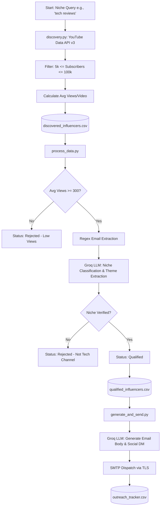

# 🚀 Micro-Influencer Outreach Pipeline

[](https://www.python.org/)
[](https://developers.google.com/youtube/v3)
[](https://groq.com/)
[](https://pandas.pydata.org/)
[](LICENSE)

An end-to-end, automated intelligence and outreach system designed to discover high-affinity **YouTube micro-influencers (5,000 – 100,000 subscribers)**, qualify leads using **Groq-accelerated LLMs**, extract contact information, synthesize hyper-personalized multi-channel pitches (Email + Instagram DM), and dispatch outreach through an authenticated SMTP engine.

---

## 📑 Table of Contents

- [Overview](#-overview)
- [System Architecture](#-system-architecture)
- [Key Features](#-key-features)
- [Repository Structure](#-repository-structure)
- [Prerequisites](#-prerequisites)
- [Installation & Setup](#-installation--setup)
- [Environment Configuration](#-environment-configuration)
- [Execution Pipeline](#-execution-pipeline)
  - [Phase 1: Channel Discovery](#phase-1-channel-discovery-discoverypy)
  - [Phase 2: AI Qualification & Enrichment](#phase-2-ai-qualification--enrichment-process_datapy)
  - [Phase 3: Copy Synthesis & Outreach](#phase-3-copy-synthesis--outreach-generate_and_sendpy)
- [Generated Artifacts & Schemas](#-generated-artifacts--schemas)
- [Configuration & Customization](#-configuration--customization)
- [Safety & Testing Guardrails](#-safety--testing-guardrails)
- [License](#-license)

---

## 💡 Overview

Micro-influencers boast significantly higher engagement rates, tighter niche trust, and higher ROI compared to macro-influencers. However, finding and vetting creators at scale is traditionally a manual, time-consuming bottleneck.

This pipeline automates the complete lifecycle:
1. **Targeted Scraping**: Queries the YouTube Data API v3 for targeted keywords, filters by subscriber brackets (5k–100k), and computes engagement metrics.
2. **AI Vetting & Contact Extraction**: Employs regex pattern matching to extract business emails from bios and prompts Groq LLMs (`qwen/qwen3.8-27b`) with structured JSON schema outputs to verify niche alignment and identify 2–3 granular content themes.
3. **Hyper-Personalized Outreach**: Generates tailored email collaboration pitches (60–90 words) referencing the creator's exact themes, along with a companion Instagram/social direct message (15–30 words).
4. **Automated Dispatch**: Sends outreach via SMTP (TLS) with safety test mode routing to audit outbound copy before live production deployment.

---

## 🏗️ System Architecture



---

## ✨ Key Features

- **Precision YouTube Discovery**:
  - Automatically handles API pagination (`nextPageToken`).
  - Pulls channel snippets and full channel statistics (`part="snippet,statistics"`).
  - Strict micro-influencer bounds (5,000 to 100,000 subscribers) to avoid celebrity inflation and unengaged ghost accounts.
  - Computes channel-level video engagement ratios (`Avg Views/Video = viewCount / videoCount`).

- **Intelligent Qualification & Enrichment**:
  - **Email Parsing**: Scans channel bio snippets using regex to extract contact details directly without manual copy-pasting.
  - **Engagement Floor**: Automatically weeds out dead channels with an average view count lower than 300.
  - **Structured JSON LLM Analysis**: Leverages Groq's high-speed inference engine with enforced JSON output to validate topical relevance and extract specific sub-themes (e.g., *"Smartphones, PC Builds, Audio Gear"*).

- **Multi-Channel Copy Generation**:
  - **Tailored Email Pitch**: Formats professional, compelling 60–90 word collaboration pitches aligned with an AI SaaS product value proposition.
  - **Companion Instagram DM**: Synthesizes a punchy 15–30 word follow-up message to boost response rates across channels.

- **Enterprise-Ready SMTP & Delivery Auditing**:
  - Authenticated TLS email delivery via standard SMTP (`smtp.gmail.com:587`).
  - **Built-in Test Mode Safeguard**: In test mode, all emails are routed to a verified test address with prefix metadata `[TEST MODE - Intended for: <Name>]`, preventing premature spam to prospect lists.
  - Full audit logging: Persists every generated message, extracted email, and delivery status to `outreach_tracker.csv`.

---

## 📂 Repository Structure

```text
micro-influencer-outreach/
├── .env.example              # Template for environment variables and API keys
├── .gitignore                # Git ignore rules for venv, secrets, and CSV datasets
├── discovery.py              # Phase 1: YouTube API search, subscriber filter, CSV export
├── process_data.py           # Phase 2: Engagement threshold, email regex, Groq classification
├── generate_and_send.py      # Phase 3: Personalized pitch synthesis and SMTP delivery
├── requirements.txt          # Python dependency specifications
└── README.md                 # Project documentation and pipeline guide
```

---

## ⚙️ Prerequisites

1. **Python 3.10+** installed on your system.
2. **Google Cloud Console Account**: Enable **YouTube Data API v3** and generate an API key.
3. **Groq Cloud Account**: Create an API key at [console.groq.com](https://console.groq.com/).
4. **Gmail Account with App Password** (or any custom SMTP server):
   - Navigate to [Google Account Security](https://myaccount.google.com/security).
   - Enable 2-Step Verification.
   - Generate a 16-character [App Password](https://myaccount.google.com/apppasswords) under "App passwords".

---

## 📦 Installation & Setup

1. **Clone the repository**:
   ```bash
   git clone https://github.com/Sanyam26362/micro-influencer-outreach.git
   cd micro-influencer-outreach
   ```

2. **Create and activate a virtual environment**:
   - **Windows (PowerShell)**:
     ```powershell
     python -m venv venv
     .\venv\Scripts\Activate.ps1
     ```
   - **macOS / Linux**:
     ```bash
     python3 -m venv venv
     source venv/bin/activate
     ```

3. **Install dependencies**:
   ```bash
   pip install -r requirements.txt
   ```

---

## 🔑 Environment Configuration

Copy the example environment file and populate your credentials:

```bash
cp .env.example .env
```

Open `.env` in your text editor and fill in your values:

```env
# Google YouTube Data API v3 Key
YOUTUBE_API_KEY=AIzaSy...

# Groq Cloud API Key
GROQ_API_KEY=gsk_...

# SMTP Credentials for Email Dispatch
SMTP_EMAIL=your_email@gmail.com
SMTP_PASSWORD=your_16_character_app_password
```

> [!WARNING]
> Never commit your `.env` file or credentials to Git. The `.gitignore` file is preconfigured to prevent `.env` and all generated `*.csv` files from being tracked.

---

## 🚀 Execution Pipeline

The pipeline runs in three sequential phases:

### Phase 1: Channel Discovery (`discovery.py`)

Searches YouTube for micro-influencers matching your target query, collects channel metrics, filters by subscriber limits, and dumps candidate records to CSV.

```bash
python discovery.py
```

- **Default Query**: `"tech reviews"` (configurable in `discovery.py` via `target_niche`).
- **Target Count**: 50 valid profiles (default).
- **Output**: `discovered_influencers.csv`

```text
[Output Sample]
Hunting for 50 'tech reviews' micro-influencers (5k-100k subs)...
Current valid profiles: 18/50
Current valid profiles: 35/50
Current valid profiles: 50/50
Success: Saved 50 qualified profiles to discovered_influencers.csv
```

---

### Phase 2: AI Qualification & Enrichment (`process_data.py`)

Reads `discovered_influencers.csv`, evaluates channel engagement, extracts contact email addresses from the bio, and passes the profile to Groq's LLM to verify niche relevance and isolate key themes.

```bash
python process_data.py
```

- **Filter Rules**:
  - Rejects profiles with `< 300` average views per video.
  - Rejects bios under 10 characters.
  - Discards channels rejected by the LLM classification prompt.
- **Outputs**:
  - `enriched_influencers.csv`: Full dataset with statuses and rejection reasons.
  - `qualified_influencers.csv`: High-value subset ready for outreach.

```text
[Output Sample]
Processing 50 profiles using Groq Llama 3.3...
[1/50] ByteReview -> Qualified
[2/50] DailyVlogs -> Rejected (Not a tech channel)
[3/50] HardwareLab -> Qualified

Processing complete!
Total Profiles: 50
Qualified Profiles: 38
Data saved to enriched_influencers.csv and qualified_influencers.csv
```

---

### Phase 3: Copy Synthesis & Outreach (`generate_and_send.py`)

Reads `qualified_influencers.csv`, generates custom email pitches and companion Instagram DMs using Groq, and dispatches the emails via SMTP.

```bash
python generate_and_send.py
```

- **Outreach Format**:
  - **Email**: 60–90 words, structured pitch referencing the creator's content themes.
  - **Social DM**: 15–30 words, casual follow-up touchpoint.
- **Safety Batching**: Limits execution to the first 5 records by default (`df.head(5)`) for safe testing.
- **Output**: `outreach_tracker.csv` logging all sent statuses and pitches.

```text
[Output Sample]
Generating and sending pitches for 5 influencers to tu236661@gmail.com...

[1/5] ByteReview -> Sent via SMTP
[2/5] HardwareLab -> Sent via SMTP
[3/5] TechUnbox -> Sent via SMTP

Completed! Outreach log saved to outreach_tracker.csv.
```

---

## 📊 Generated Artifacts & Schemas

| File | Produced By | Description | Key Fields |
|---|---|---|---|
| `discovered_influencers.csv` | `discovery.py` | Raw discovered channels meeting subscriber criteria | `Name`, `Platform`, `Profile URL`, `Followers`, `Avg Views/Video`, `Category / Niche`, `Bio Snippet` |
| `enriched_influencers.csv` | `process_data.py` | Comprehensive dataset with AI audit trails | All discovery fields + `Status`, `Rejection Reason`, `Refined Niche`, `Content Themes`, `Contact Email` |
| `qualified_influencers.csv` | `process_data.py` | Filtered list containing only `Status == 'Qualified'` leads | Clean subset used directly by copy generation |
| `outreach_tracker.csv` | `generate_and_send.py` | Historical log of generated pitches and dispatch results | `Influencer`, `Original Extracted Email`, `Test Delivery Address`, `Email Pitch`, `Instagram DM`, `Sent Status`, `Date` |

---

## 🛠️ Configuration & Customization

### Changing the Target Niche
In [discovery.py](file:///d:/projects/micro-influencer-outreach/discovery.py):
```python
if __name__ == "__main__":
    target_niche = "fitness workout"  # Change to your desired niche
    data = discover_micro_influencers(target_niche, target_count=50)
```

### Adjusting Subscriber Thresholds
In [discovery.py](file:///d:/projects/micro-influencer-outreach/discovery.py#L50):
```python
# Adjust subscriber bounds (e.g., 10k to 50k)
if 10000 <= sub_count <= 50000:
    ...
```

### Switching LLM Models
In [process_data.py](file:///d:/projects/micro-influencer-outreach/process_data.py#L54) and [generate_and_send.py](file:///d:/projects/micro-influencer-outreach/generate_and_send.py#L45):
```python
# Select any model supported by Groq Cloud (e.g., llama-3.3-70b-versatile, qwen/qwen3.8-27b)
model = "llama-3.3-70b-versatile"
```

### Moving from Test Mode to Live Outreach
In [generate_and_send.py](file:///d:/projects/micro-influencer-outreach/generate_and_send.py#L60-L75):
1. In `send_email_smtp`, swap `msg['To'] = TEST_RECEIVER_EMAIL` to the influencer's verified email:
   ```python
   recipient = original_email if original_email != "Not Found" else TEST_RECEIVER_EMAIL
   msg['To'] = recipient
   ```
2. Remove `.head(5)` in `process_and_send()` to process the full qualified dataset.

---

## 🛡️ Safety & Testing Guardrails

- **CAN-SPAM & Anti-Spam Compliance**:
  - Always include valid business contact information and an unsubscribe link in cold email pitches.
  - Never blast hundreds of emails in minutes. Introduce staggered rate limiting (`time.sleep`) when operating in live environments.
- **Gmail SMTP Limits**:
  - Standard Gmail accounts have a sending limit of ~500 emails/day (Google Workspace allows up to 2,000/day).
- **Test Mode Protection**:
  - The script defaults to routing messages to a designated developer test inbox (`TEST_RECEIVER_EMAIL`) so you can review copy fidelity before engaging real creators.

---

## 📄 License

This project is licensed under the [MIT License](LICENSE).
